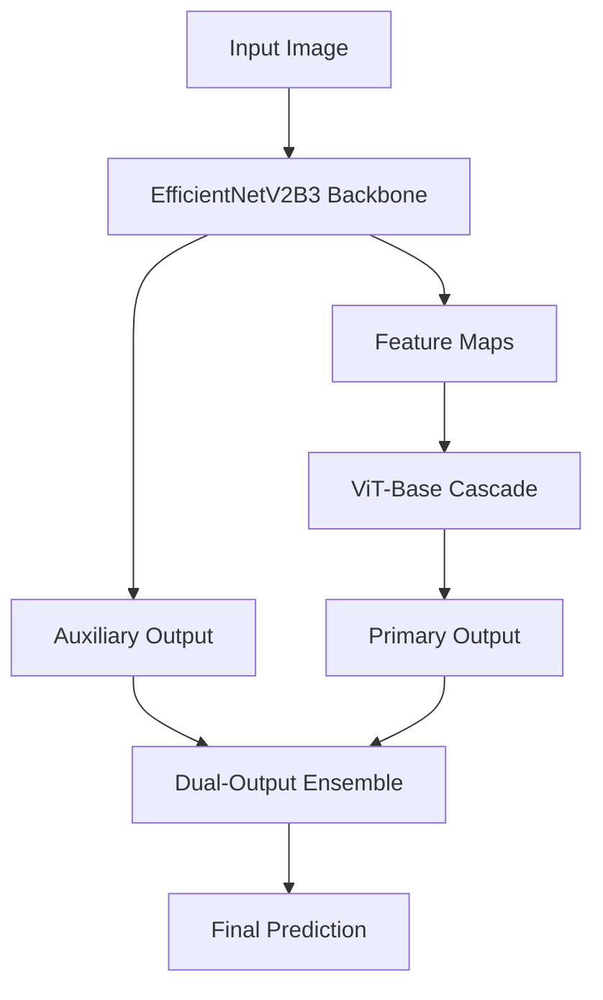
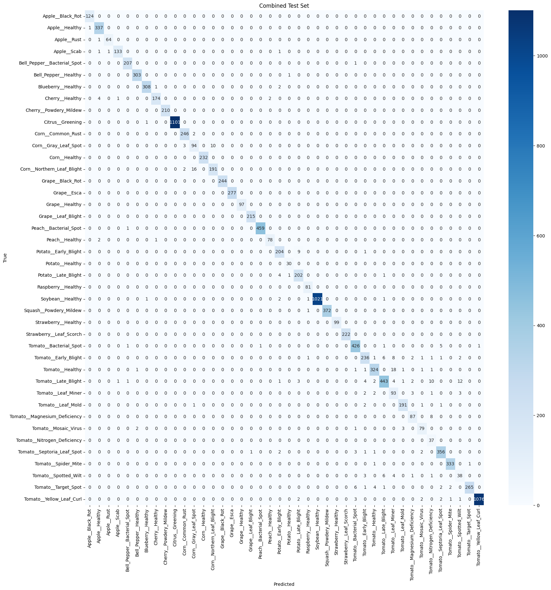

# Plant Disease Classification: Hybrid Vision Transformer & EfficientNet Architecture

)

---

## Project Overview

Disease classification models often suffer from performance degradation when introduced to new domains or environmental conditions. This project attempts to reduce that by employing a multi-stage training pipeline. The model first learns general plant disease representations on a base dataset and then adapts to a new target domain using dynamic class weighting and rehearsal buffers to retain base knowledge.

**Key Features:**

- **Hybrid Architecture:** Cascaded EfficientNetV2B3 feature extractor and Vision Transformer (ViT-Base) for rich spatial and global attention representations.
- **Domain Adaptation:** Stage-wise training with a 10% rehearsal buffer and discriminative learning rates to adapt to the Tomato-Village dataset without forgetting original classes.
- **Explainability (XAI):** Built-in Grad-CAM++ for EfficientNet and Attention Rollout for the ViT to visualize decision-making processes.
- **Production Ready:** ONNX inference optimization and benchmarking.
- **Advanced Augmentations:** Integrated Mixup and CutMix in a custom training loop.

---

## Model Architecture

The architecture is designed as a dual-output ensemble:

1. **EfficientNetV2B3 Backbone:** Acts as the primary feature extractor, trained initially to identify local disease patterns.
2. **ViT-Base Cascade:** Receives processed feature maps and uses self-attention to correlate global contextual information.

---

## Dataset Pipeline

### Datasets Used

- Plant-Doc Dataset: ) 
- Plant Village Dataset: ) 
- Tomato Village Dataset: )

This project aggregates three Kaggle plant disease datasets into a unified pipeline:

- **Canonical Label Mapping:** Standardizes labels across disparate data sources.
- **Train/Val/Test Splits:** Carefully stratified to ensure balanced evaluation.

---

## Training Strategy

### Stage 1: Base Knowledge Acquisition

- **Stage 1a:** EfficientNetV2B3 backbone is trained on the primary dataset.
- **Stage 1b:** The ViT cascade is introduced and trained alongside the backbone.

### Stage 2: Domain Adaptation

- Adapts the network to the specific characteristics of the `Tomato-Village` dataset.
- Mitigates catastrophic forgetting by utilizing a rehearsal buffer composed of 10% of the original PlantVillage training data.
- Implements dynamic class weighting to ensure balanced updates across old and new domain classes.

---

## Evaluation & Results

The evaluation pipeline generates per-dataset and combined metrics, including detailed classification reports and confusion matrices.

  

---

## Explainability (XAI)

To ensure the model is focusing on actual disease symptoms rather than background artifacts:

- **Grad-CAM++** is applied to the EfficientNet convolutions to highlight localized disease markers.
- **Attention Rollout** is applied to the ViT attention heads to show global context aggregation.

  

---

## Inference and Benchmarking

The final hybrid model is exported as separate ONNX graphs (EfficientNet and ViT heads). A Python ensemble pipeline loads these ONNX graphs for inference benchmarking, ensuring the model meets latency requirements for deployment.

---

## Usage

1. Open the Kaggle Notebook: [`plantdiseaseclassificationv2.ipynb`](https://www.kaggle.com/code/anat3l/plantdiseaseclassificationv2).
2. Use the GPU T4 and add your WandB API key.
3. Follow the cell-by-cell execution.
4. Check the generated `outputs/` or `assets/` directories for model checkpoints, ONNX files, wandb and evaluation plots.
